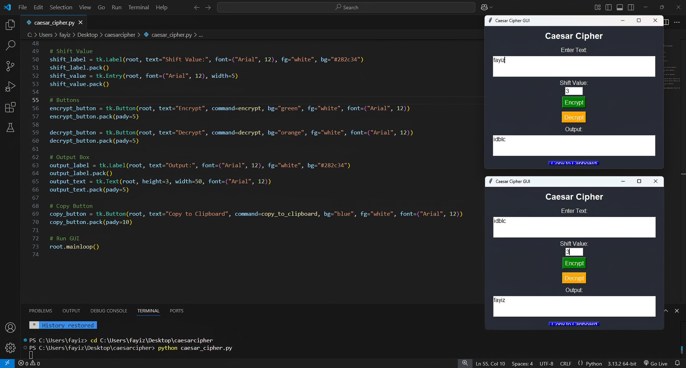

# 🔐Caesar Cipher GUI - Python

## Overview
This is a **Caesar Cipher GUI** application built using **Python and Tkinter**. It allows users to encrypt and decrypt text using the **Caesar Cipher algorithm** with a specified shift value.

## Features
✅ Encrypts and decrypts text using the Caesar Cipher method.  
✅ User-friendly GUI with text input and shift value selection.  
✅ Supports uppercase, lowercase, and special characters.  
✅ Copy output text to clipboard with a confirmation popup.  
✅ Simple and lightweight application.

## Requirements
Ensure you have Python installed. The application uses:
- **Python 3.x**
- **Tkinter** (built-in with Python)

## Installation & Usage
### 1. Clone or Download the Project
```bash
git clone https://github.com/FAYIZ-MP/PRODIGY_CS_01.git
cd caesar-cipher
```

### 2. Run the Program
Run the script using:
```bash
python caesar_cipher_gui.py
```

### 3. How to Use
1. Enter the **text** you want to encrypt or decrypt.
2. Provide a **shift value** (e.g., 3 shifts letters forward/backward).
3. Click **Encrypt** to get the encrypted text.
4. Click **Decrypt** to decode a previously encrypted text.
5. Click **Copy to Clipboard** to copy the result.

## Example Usage
**Encryption:**  
- Input: `Hello World`
- Shift: `3`
- Output: `Khoor Zruog`

**Decryption:**  
- Input: `Khoor Zruog`
- Shift: `3`
- Output: `Hello World`

## 🖼️Screenshot


## 📜 License
Licensed under the **MIT License**.

## 👨‍💻 About the Developer
Developed by **Fayiz M P**, a passionate **Cybersecurity Engineer & Developer** focused on creating secure and innovative applications.

🔗 [LinkedIn]www.linkedin.com/in/fayiz-m-p-361228295 | [GitHub]https://github.com/FAYIZ-MP


